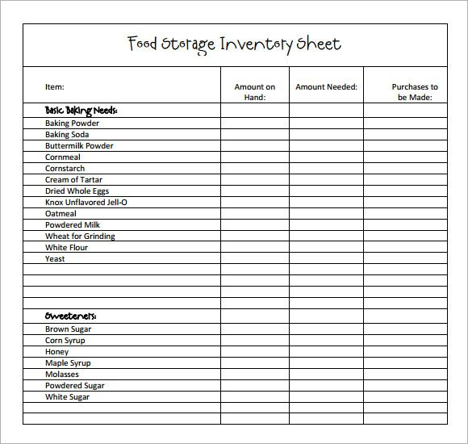

Yaygın inancın tersine, Lorem Ipsum rastgele sözcüklerden oluşmaz. Kökleri M.Ö. 45 tarihinden bu yana klasik Latin edebiyatına kadar uzanan 2000 yıllık bir geçmişi vardır. Virginia'daki Hampden-Sydney College'dan Latince profesörü Richard McClintock, bir Lorem Ipsum pasajında geçen ve anlaşılması en güç sözcüklerden biri olan 'consectetur' sözcüğünün klasik edebiyattaki örneklerini incelediğinde kesin bir kaynağa ulaşmıştır. Lorm Ipsum, Çiçero tarafından M.Ö. 45 tarihinde kaleme alınan "de Finibus Bonorum et Malorum" (İyi ve Kötünün Uç Sınırları) eserinin 1.10.32 ve 1.10.33 sayılı bölümlerinden gelmektedir. Bu kitap, ahlak kuramı üzerine bir tezdir ve Rönesans döneminde çok popüler olmuştur. Lorem Ipsum pasajının ilk satırı olan "Lorem ipsum dolor sit amet" 1.10.32 sayılı bölümdeki bir satırdan gelmektedir.

1500'lerden beri kullanılmakta olan standard Lorem Ipsum metinleri ilgilenenler için yeniden üretilmiştir. Çiçero tarafından yazılan 1.10.32 ve 1.10.33 bölümleri de 1914 H. Rackham çevirisinden alınan İngilizce sürümleri eşliğinde özgün biçiminden yeniden üretilmiştir.

  

      
  

  

    
  

